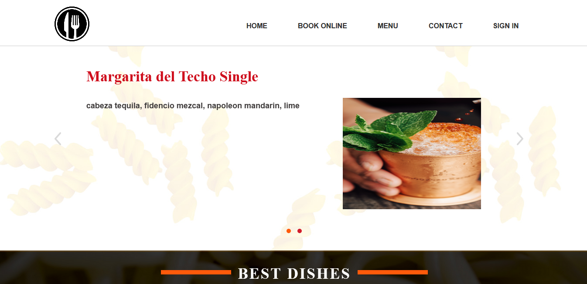

## Introduction

EasyRestaurant is a web application to manage online reservations for a restaurant.

## Informations
-   Status under development
-   Latest version 1.0
-   Sector: service
-   Created: November 2020
-   Last updated: November 2020

## Table of contents
* [Documentation](#general-info)
* [Demo](#demo)
* [Screenshots](#screenshots)
* [Technologies](#technologies)
* [Setup](#setup)
* [Features](#features)
* [Status](#status)
* [Contact](#contact)
* [License](#license)

## Documentation
https://github.com/aniskchaou/EASY-RESTAURANT-FRONTOFFICE-BACKOFFICE-ADMIN-USER/wiki

## Demo
https://restaurant-management-laravel.herokuapp.com/

## Screenshots

## Technologies
* PHP
* Laravel

## Setup

## Features
 -  booking online
-   product management
-   category management
-   contact admin

## Contact
contact@delta-dev-software.com

## License
<a href="license.txt">MIT License</a>